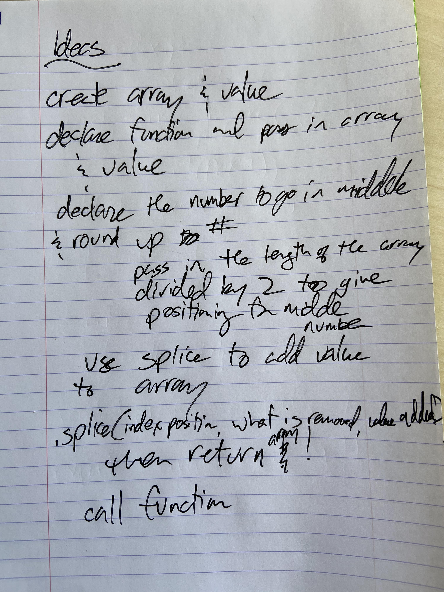

[Shift Array](javascript/code-challenges/arrayShift/array-shift.js)

# Challenge Summary
Code challenge to insert value into middle of array.

## Challenge Description
Without using built in methods, insert a value into the middle of an array.

## Approach & Efficiency
I used splice to add to middle of array, but, first had to figure out how to create a value for the middle of it to insert into.

## Solution

=====================================================================

[Array Binary](javascript/code-challenges/arrayBinarySearch/array-binary-search.js)

# Challenge Summary
eturn index of sorted array's element that is equal to search key.

## Challenge Description
Return index of sorted array's element that is equal to search key, or -1 if element doesn't exist.

## Approach & Efficiency
Used a function to declare beginning and end of sorted array (-1 if end of array because index begins at 0).  Built an if else statement that divides the array in half and creates a conditiona that says if key is greater than middle, remove what's on left so that function continues searching on right and vice versa if it's less than.

## Solution

=====================================================================

# Singly Linked List
Create a node class that has properties for the value stored in the Node.

## Challenge
Define a method called insert which takes any value as an argument and adds a new node with that value to the head of the list with an O(1) Time performance.
Define a method called includes which takes any value as an argument and returns a boolean result depending on whether that value exists as a Node’s value somewhere within the list.

## Approach & Efficiency
Looked up what "append" does and discovered that it means to put nodes at the end.

## API
**Insert**
- if head doesn't exist, set node to head
- if head does exist, let the current node be the head
- traverse the linked list with the while loop
- when traverse is complete, current.next will set the node as the next value
- at the end, return this to return the whole list

=====================================================================

# Data Structures and Algorithms

See [setup instructions](https://codefellows.github.io/setup-guide/code-301/3-code-challenges), in the Code 301 Setup Guide.

## Repository Quick Tour and Usage

### 301 Code Challenges

Under the `data-structures-and-algorithms` repository, at the top level is a folder called `code-challenges`

Each day, you'll add one new file to this folder to do your work for the day's assigned code challenge

### 401 Data Structures, Code Challenges

- Please follow the instructions specific to your 401 language, which can be found in the directory below, matching your course.
